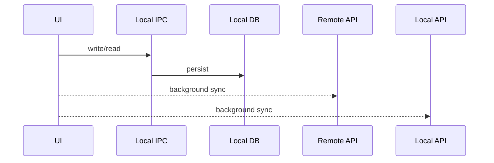
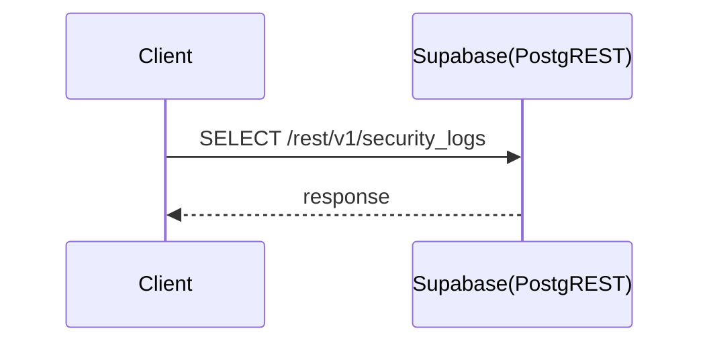
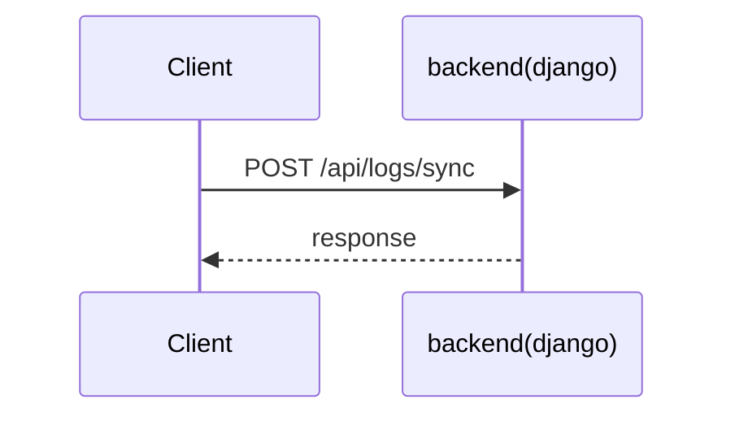

# API Call Flows (Mermaid)

## Local-first (example)

## Auto-generated endpoint flows (top used)
### EXTERNAL SELECT /rest/v1/security_logs
- Call sites: src/App.jsx, src/dbClient.js

### REST POST /api/logs/sync
- Call sites: src/dbClient.js

